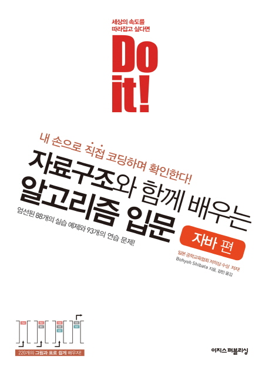

# 🖥️ 숭실대 알고리즘 스터디

## 사용하는 책
<table>
 <tr> 
    <td> 
        
    </td>
    <td>
        
    </td>
</tr>
</table>
## 목차

| 날짜 | 책 | 목차 |  | 링크 |
| --- | --- | --- | --- | --- |
| 5.9 | x |  | 오리엔테이션, 깃허브, 깃 사용 |  |
| 5.14 | Do it! 자료구조와 함께배우는 알고리즘 입문 | 1장,2장 | 기본 알고리즘, 기본 자료구조 |[1장_2장](https://github.com/algorithmSSU/data_struct_chap_1_2) |

## 괜찮은 자료 모음
[패스트캠퍼스알고리즘테스트](https://github.com/rhs0266/FastCampus.git)